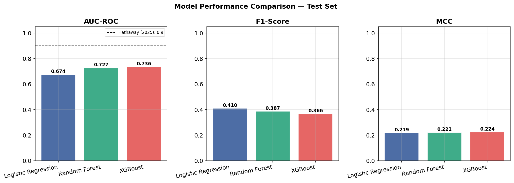
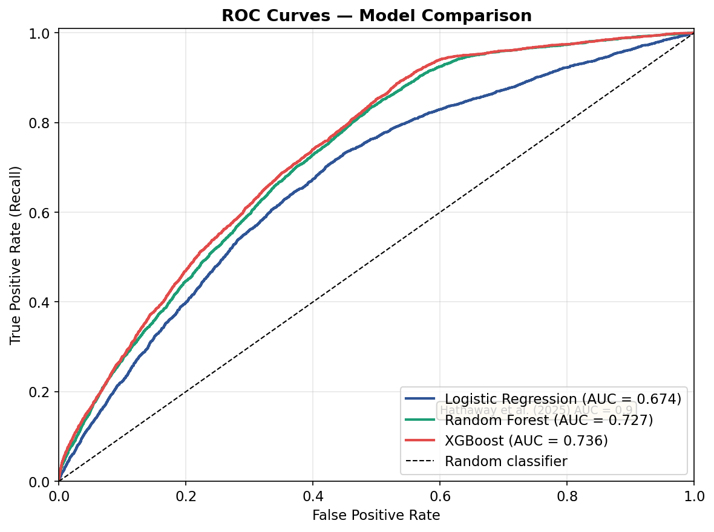

# Predicting Patient Appointment No-Shows

### A Comparative Study of Bagging and Boosting Ensembles with SHAP and LIME Explainability Analysis

**MSc Computer Science with Business Development**  
**Ulster University, Manchester**

---

## Overview

This repository contains my MSc Research Project on predicting patient appointment no-shows using machine learning and Explainable AI (XAI).

The project replicates and extends the methodology of **Hathaway et al. (2025)** by comparing **Logistic Regression**, **Random Forest**, and **XGBoost** on the publicly available **Medical Appointment No-Show** dataset. In addition to model comparison, the project investigates model explainability using **SHAP** and **LIME**, evaluates statistical significance using **McNemar's Test**, and conducts a demographic fairness audit across age, gender, and scholarship status.

---

## Research Objectives

- Predict patient appointment no-shows using machine learning.
- Compare statistical, bagging, and boosting models.
- Evaluate performance using robust validation techniques.
- Explain predictions using SHAP and LIME.
- Assess demographic fairness across patient groups.
- Compare findings with published research.

---

## Project Visuals

### Model Performance Comparison



### ROC Curve Comparison



---

## Dataset

| Item | Details |
|------|---------|
| **Dataset** | Medical Appointment No-Show Dataset |
| **Source** | Kaggle (Netto, 2016) |
| **Appointments** | 110,527 |
| **Target Variable** | Appointment Attended vs No-Show |
| **No-show Rate** | Approximately 20% |

This is a publicly available secondary dataset widely used in healthcare machine learning research.

---

## Project Workflow

The project follows a complete end-to-end research pipeline across four Google Colab notebooks.

| Notebook | Purpose |
|----------|---------|
| **Notebook 01** | Data preprocessing and feature engineering |
| **Notebook 02** | Model training and evaluation |
| **Notebook 03** | SHAP and LIME explainability analysis |
| **Notebook 04** | Demographic fairness audit |

---

## Methodology

### Data Preparation

- Removed invalid records (negative ages and impossible appointment dates).
- One-hot encoded categorical variables.
- Applied Min-Max scaling.
- Engineered additional features:
  - `lead_time_days`
  - `prior_noshow_ratio`
  - scheduling-related features
- Applied **SMOTENC** to the training set only after the train-test split to address class imbalance while preventing data leakage.

### Models Compared

- Logistic Regression (Baseline)
- Random Forest (Bagging Ensemble)
- XGBoost (Boosting Ensemble)

### Validation Strategy

- Stratified 80/20 Train-Test Split
- Stratified 5-Fold Cross-Validation
- McNemar's Statistical Significance Testing

### Evaluation Metrics

- AUC-ROC
- F1-Score
- Precision
- Recall
- Matthews Correlation Coefficient (MCC)

---

## Results

### Cross-Validation Performance

| Model | CV AUC |
|--------|--------|
| Logistic Regression | 0.6788 |
| Random Forest | 0.9171 |
| **XGBoost** | **0.9177** |

XGBoost exceeded the benchmark reported by **Hathaway et al. (2025)** during cross-validation.

### Test Set Performance

| Model | Test AUC |
|--------|----------|
| Logistic Regression | 0.6742 |
| Random Forest | 0.7265 |
| **XGBoost** | **0.7357** |

XGBoost achieved the highest performance on the held-out test set and outperformed previous same-dataset comparisons reported by **Abushaaban & Agaoglu (2022)**.

---

## Explainable AI

The best-performing XGBoost model was interpreted using two complementary explainability frameworks.

### SHAP

SHAP provided both global and local feature importance explanations.

Key findings:

- `lead_time_days` was the strongest predictor.
- Age emerged as an important predictor.
- Prior no-show behaviour contributed substantially to predictions.

### LIME

LIME generated local explanations for individual patient predictions.

### SHAP vs LIME Comparison

A Spearman rank correlation of **0.2108** indicated poor agreement between SHAP and LIME feature rankings, demonstrating that different explainability frameworks can produce different interpretations of the same model.

---

## Statistical Validation

McNemar's Test was used to determine whether performance differences between models were statistically significant.

| Comparison | Result |
|------------|--------|
| XGBoost vs Random Forest | Significant |
| XGBoost vs Logistic Regression | Significant |
| Random Forest vs Logistic Regression | Significant |

All pairwise comparisons produced **p < 0.0001**.

---

## Fairness Audit

A demographic fairness audit evaluated **False Negative Rate (FNR)**, representing the proportion of genuine no-shows that the model failed to identify.

### Age Groups

The largest disparity occurred across age groups.

- **Lowest FNR:** Young Adults (18–35)
- **Highest FNR:** Older Adults (56+)
- **FNR Gap:** **0.416**

### Gender

Female and male patients showed similar FNR values, with no statistically significant difference.

### Scholarship Status

Patients with scholarship status showed a lower FNR than patients without scholarship, representing an interesting socioeconomic finding within this dataset.

---

## Repository Structure

```text
patient-appointment-no-show-prediction/
│
├── notebooks/
│   ├── Notebook_01_Preprocessing.ipynb
│   ├── Notebook_02_Training_and_Evaluation.ipynb
│   ├── Notebook_03_SHAP_LIME_Explainability.ipynb
│   └── Notebook_04_Demographic_Fairness_Audit.ipynb
│
├── figures/
│   ├──fig_08_cv_auc_per_fold.png
│   ├── fig_09_model_comparison.png
│   ├── fig_11_roc_curves.png
│   ├──fig_19_shap_vs_lime_comparison.png
│   └──fig_21_fairness_age.png
│
├── dataset/
│
├── requirements.txt
│
└── README.md
```

---

## Technologies Used

- Python
- Google Colab
- Pandas
- NumPy
- Scikit-learn
- XGBoost
- SHAP
- LIME
- Matplotlib
- Seaborn
- Statsmodels
- SciPy
- Joblib

---

## Key References

This project builds upon the following published research:

- Hathaway et al. (2025)
- Abushaaban & Agaoglu (2022)
- Deina et al. (2024)
- Lundberg & Lee (2017)
- Ribeiro et al. (2016)
- Obermeyer et al. (2019)

---

## Research Highlights

- **110,527** patient appointments analysed
- **3** machine learning models compared
- **5-fold** stratified cross-validation
- **XGBoost** achieved the best performance (CV AUC **0.9177**, Test AUC **0.7357**)
- SHAP and LIME explainability comparison
- McNemar's statistical significance testing
- Demographic fairness audit across multiple patient groups

---

## Author

**Cicel Aslam**  
*MSc Computer Science with Business Development*  
**Ulster University, Manchester**
